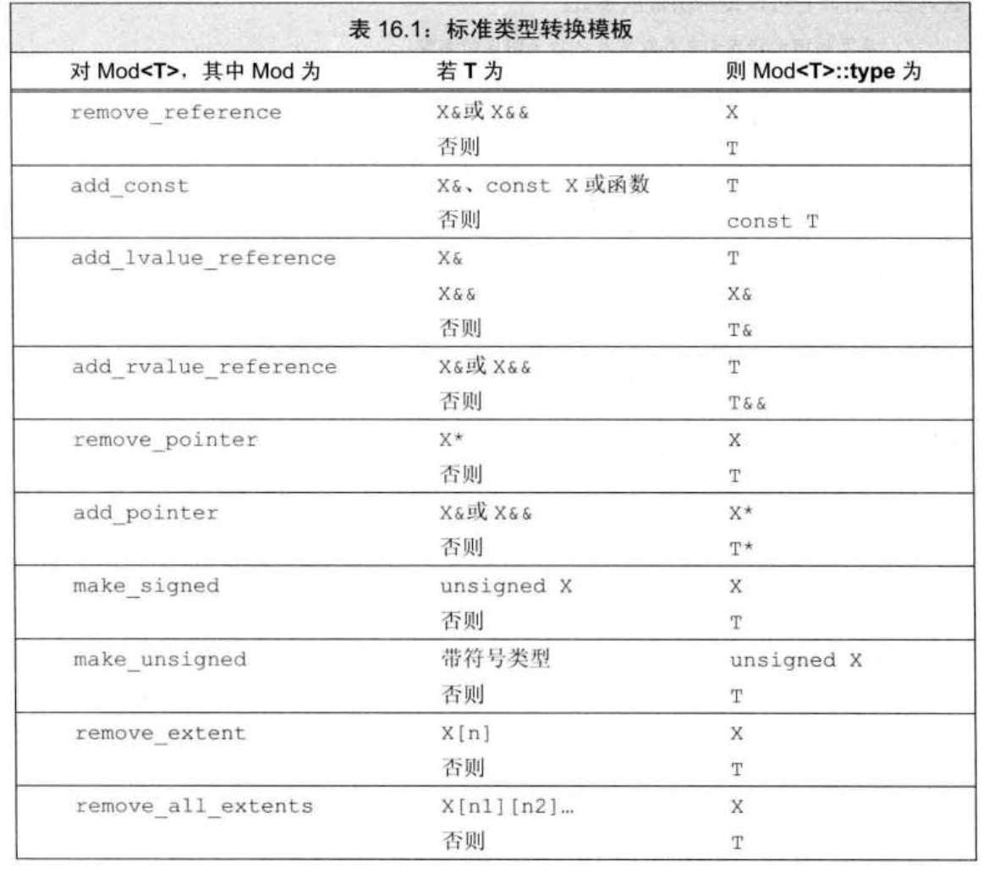

## 16.1

1. 除了指定模版类型参数，还可以在模版中定义 **非类型参数**

    非类型参数被 一个用户提供的值，或者编译器推断出的一个值所代替，由于 **模版实例化发生在编译时**，因此，**这个值必须是一个常量表达式**

    ```cpp
    // 非类型模版参数
    // N、M 必须是一个常量表达式
    template <unsigned N, unsigned M>
    bool cmp(const char (&s0)[N], const char (&s1)[M])
    {
        return strcmp(s0, s1);
    }
    
    cmp("hh", "mm");
    cmp<3, 3>("hh", "mm");
    cmp<2, 2>("hh", "mm"); // 错误，模版参数与实参类型不同
    ```

2. inline 和 constexpr 说明符放在模版参数列表后，返回类型前：

    ```cpp
    template<typename T> inline void func(T &); // 正确

    inline template<typename T> void func(T &); // 错误
    ```

3. 为了生成一个模版的实例，编译器需要知道函数模版或者类模版的定义，因此，模版的头文件一般 **既包含声明，也包含定义**
4. 类模版的头文件需要有类模版的定义，成员定义，以及所有用到的名字的声明


### 一对一友好关系

友元关系被限制在使用 **相同类型** 实例化的两个模版之间

```cpp
template<typename T>
class A;

template<typename T>
void func(const A<T> &a);

template<typename T>
class A
{
    friend void func<>(const A<T> &a);
    T val;
public:
    A(const T &val)
        :val(val) {}
};

template<typename T>
void func(const A<T> &a)
{
    std::cout << a.val << std::endl;

    A<double> da(1.2);
    // 如果 T 不是 double，那么错误，func<double> 不是 A<T> 的友元
    std::cout << da.val << std::endl; 
}
```

上面的 A<T> 与 func<T> 就是一对一友好关系

### 通用和特定的模版友好关系

一个类也可以将另一个模版的每一个实例声明成自己的友元

友元声明中必须使用 **与类模版不同的** 模版参数

```cpp
template <typename T>
class A;

template<typename X>
void func1(void);

template <typename T>
class A
{
    template <typename X> friend void func1(void);
    T val;

public:
    A(const T &val)
        : val(val) {}
};


template <typename X>
void func1(void)
{
    A<int> ia(1);
    A<double> da(2.0);
    A<std::string> sa("?");

    std::cout << ia.val << std::endl;
    std::cout << da.val << std::endl;
    std::cout << sa.val << std::endl;
}

void test(void)
{
    func1<int>();
}
```

func1 的每一个实例都可以访问 A 类的每一个实例的私有成员

### 将访问权限授予一个类型

新标准允许将一个类的访问权限授予一个类型：

```cpp
struct B;

template <typename T>
class A
{
    friend B;
    T val;

public:
    A(const T &val)
        : val(val) {}
};


struct B
{
    void operator()()
    {
        A<int> a(10);
        std::cout << a.val << std::endl;
    }
};

void test(void)
{
    B()();
}
```

### 模版类型别名

```cpp
template <typename T>
using twin = std::pair<T, T>;

void test(void)
{
    twin<int> ip; // std::pair<int, int>
    twin<double> ip; // std::pair<double, double>
}
```

### 类模版的静态成员

```cpp
template <typename T>
struct A
{
    static T val;
};

template <typename T>
T A<T>::val = 0;


void test(void)
{
    ++A<int>::val;
    std::cout << A<double>::val << std::endl; // 0

    // std::cout << A::da << std::endl; // 错误，缺少 类模板 "A" 的参数列表
}
```

```std::cout << A<double>::val << std::endl; // 0``` 输出 0 的原因：A<int> 和 A<double> 是两个完全不同的类型，分别有一个 val 静态成员

### 模版参数与作用域

模版参数遵守普通作用域规则

```cpp
using A = double;

template <typename A, typename B>
void func(void)
{
    A a; // a 的类型是使用 func 时，动态绑定的类型，而不是 double

    double B; // 错误，不能重声明模版参数名
    B = 1.1;
}
```

### 模版声明

模版声明 **必须** 包含模版参数，特别是模版类（容易忘

```cpp
template <typename T>
class Blob;
```

**一个特定文件所需要的所有模板的声明通常一起放置在文件开始位置，出现于任何使用这些模板的代码之前**

### 类的类型成员

由于静态成员和类型成员都可以使用运算符 ```::``` 来访问，因此，如果某个类是模版类，编译器就无法判断该成员是一个静态成员还是类型成员，它会假定该成员是一个静态成员

如果该成员是一个类型成员，我们需要显式的使用关键字 ```typename``` 来实现这一点

```cpp
class A
{
public:
    using value_type = std::string::value_type;
};

template <typename T>
class B
{
    public:
    using value_type = std::string::value_type;
};

void test(void)
{
    A::value_type i = 'a'; // 正确，A 是一个普通类

    B<int>::value_type j = 'b'; // 错误？编译器默认 value_type 是一个静态数据成员

    typename B<int>::value_type k = 'c'; // 正确，显式指定 value_type 是一个类型成员

    // class B<int>::value_type m = 'd'; // 错误，只能使用 typename
}
```

**注意：** 显式指定类型成员时，只能使用关键字 typename，不能使用 class

### 默认模版实参

```cpp
template <typename _randomIterator, typename _F = std::less<typename _randomIterator::value_type>> // 默认模版实参
void Bubble_sort(_randomIterator begin, _randomIterator end, _F f = _F()) // 默认函数实参
{
    bool sorted = true;
    for (auto i = begin; i != end && sorted; ++i)
    {
        sorted = false;
        for (auto j = begin + 1; j != end - (i - begin); ++j)
        {
            if (f(*j, *(j - 1)))
            {
                sorted = true;
                std::swap(*j, *(j - 1));
            }
        }
    }
}
```

在 C++ 中，对于具有默认模板参数的模板类，当使用默认参数时，确实需要加上一对空尖括号（<>）来指示使用默认参数。

例如，假设有一个具有默认模板参数的模板类 `MyClass`：

```cpp
template<typename T = int>
class MyClass {
    // 类定义
};
```

如果要使用默认参数，正确的写法是加上一对空尖括号：

```cpp
MyClass<> obj;  // 使用默认参数
```

这样可以确保编译器知道要使用模板类的默认参数。

然而，C++17 引入了一个特性，称为"类模板参数推导"（Class Template Argument Deduction, CTAD），允许在某些情况下省略一对空尖括号。

具体来说，当使用 CTAD 时，如果构造函数中的参数提供了足够的信息以推导出模板参数类型，可以省略一对空尖括号。例如，对于上面的模板类 `MyClass`，可以使用 CTAD 进行如下的写法：

```cpp
MyClass obj;  // 使用默认参数（CTAD）
```

在这个例子中，编译器会根据构造函数参数类型推导出 `T` 的类型为 `int`，因此可以省略一对空尖括号。

需要注意的是，CTAD 并不适用于所有情况，只有在满足一定的推导规则和条件时才会生效。因此，在使用具有默认模板参数的模板类时，为了提高代码的可读性和可移植性，建议在使用默认参数时加上一对空尖括号，以明确指示使用默认参数

### 普通类的成员模版

```cpp
// unique_ptr 的删除器，删除在栈区分配的元素
struct DeleteForStack
{
    // 普通类的成员模版
    template <typename T>
    void operator()(T *p)
    {
        // 空实现
    }
};

void test(void)
{
    int a = 42; // 栈区分配的
    DeleteForStack d;

    // std::unique_ptr<int> up(&a); // 错误，不能使用默认的删除器
    std::unique_ptr<int, DeleteForStack> up(&a, d);
}
```

### 模版类的成员模版

```cpp
template <typename T>
struct A
{
    std::vector<T> val;
    template <typename _Iterator>
    A(_Iterator begin, _Iterator end)
    {
        for(auto it = begin; it != end; ++it)
        {
            val.push_back(*it);
        }
    }

};

void test(void)
{
    int arr[] = {1, 2 ,3 ,4};
    std::vector<std::string> arr1 = {"q","w","e","r","t"};
    A<int> a0(std::begin(arr), std::end(arr));
    A<std::string> a1(arr1.begin(), arr1.end());
    std::cout << a0.val << std::endl;
    std::cout << a1.val << std::endl;
}
```

### 控制实例化（重点）

我们知道，只有当一个模版被使用时，它才会被实例化

这一特性意味着：如果有 **多个文件使用了相同的类模版**，并且 **这些类模版的模版参数相同**时，每个文件 **都** 会有该模版的一个实例

可以想到，在大文件系统中，多次实例化相同的模版开销可能非常严重

C++ 11 提供了 **显式实例化** 这一方式来解决这个问题

#### 语法

```cpp
extern template declaration // 实例化声明

template declaration // 实例化定义
```

其中，declaration 是一个类，或者函数的声明，其中的 **所有参数** 均 **被替换为模版实参**

例如：

```cpp
extern template bool cmp(const int &, const int &);
extern template class Blob<int>;
```

#### 注意

1. 当编译器遇到 extern 声明时，它不会在本文件生成实例化代码

    这就意味着 **承诺** 在程序的某个地方 **一定有该实例化的一个非 extern 声明**

2. 可以有多个 extern 声明，但 **只有一个** 实例化定义

3. 由于 *只有当一个模版被使用时，它才会被实例化* 这个特性，**extern 声明必须出现在任何可能使用此实例化版本的代码之前**

4. 对于一个模版类来说，实例化定义会实例化 **所有** 成员，因此，**在一个类模版的实例化定义中，所用类型必须能用于模版的所有成员函数**

    ```cpp
    class NoDefault
    {
        NoDefault(int){}
    };
    
    extern template class std::vector<NoDefault>;
    
    template class std::vector<NoDefault>;
    ```

    上述代码会发生编译错误，vector 的默认构造函数会使用到模版参数类型的默认构造函数，而类 NoDefaault 没有默认构造函数，因此，在 vector<NoDefault> 的实例化定义中，所用类型就 **不能** 用于模版的所有成员函数，因此，**不能显式实例化 vector<NoDefault>**

#### 实例

```cpp
// Example.h
#pragma once
#include <iostream>
#include <vector>

template <typename T>
struct Example
{
    T val;
    std::vector<T> vec;

    Example(T val)
        :val(val) {}

    Example(T val, const std::initializer_list<T> &list)
        :val(val), vec(list) {}

    // template <typename X>
    // void func(X obj)
    // {
    //     std::cout << obj << std::endl;
    // }
};

template <typename _randomIterator, typename _F = std::less<typename _randomIterator::value_type>> // 默认模版实参
void Bubble_sort(_randomIterator begin, _randomIterator end, _F f = _F()) // 默认函数实参
{
    bool sorted = true;
    for (auto i = begin; i != end && sorted; ++i)
    {
        sorted = false;
        for (auto j = begin + 1; j != end - (i - begin); ++j)
        {
            if (f(*j, *(j - 1)))
            {
                sorted = true;
                std::swap(*j, *(j - 1));
            }
        }
    }
}

template <typename T>
std::ostream &operator<<(std::ostream &cout, const std::vector<T> &arr)
{
    for (const T &num : arr)
        std::cout << num << " ";
    return cout;
}

// Application.cc
#include <iostream>
#include "Example.h"

// 实例化声明，向编译器说明在程序的某个地方有一个 Example<int> 的实例化定义
// 由于编译器在使用一个模版时，自动实例化
// 因此，若想避免这一点，extern 声明必须出现在任何可能使用此实例化版本的代码之前
extern template struct Example<int>; 

// 必须补充函数的默认实参
extern template void Bubble_sort(std::vector<int>::iterator, std::vector<int>::iterator, std::less<int>);

extern template std::ostream& operator<<(std::ostream &os, const std::vector<int>&);

void test(void)
{
    Example<int> e(0, {1, 3, 4, 2, 5});
    Bubble_sort(e.vec.begin(), e.vec.end());

    std::cout << e.val << std::endl;
    std::cout << e.vec << std::endl;

    // e.func("NiuMa");
}

// templateBuild.cc
#include "Example.h"

// 实例化 Example 类的所有成员
template struct Example<int>;

// 实例化特定模版参数的函数
template void Bubble_sort(std::vector<int>::iterator, std::vector<int>::iterator, std::less<int>);

// 实例化特定模版参数的函数
template std::ostream& operator<<(std::ostream &os, const std::vector<int>&);

// main.cpp
#include "Example.h"
void test();

int main(void)
{
    test();
} 
```

## 16.2

### 类型转换与模版类型参数

将实参传递给带模版类型的实参时，可以应用的转换有：

* const 转换
* 数组或函数向指针的转换

其它转换均不被允许，如算术类型转换，用户自定义的转换，派生类到基类的转换等

```cpp
template <typename T>
void func0(T, T){}

template <typename T>
void func1(const T&, const T&){}

void test(void)
{
    func0(0, 1.1); // 错误，不能应用算术类型转换

    const std::string s0;
    std::string s1;
    func0(s0, s1); // 正确，const 被忽略
    func1(s0, s1); // 正确，将 s0 转换为 const 是允许的

    int arr0[10], arr1[20];
    func0(arr0, arr1); // 正确，可以应用数组到指针类型的自动转换，实例化为：func0<int *>(int *, int *)
    func1(arr0, arr1); // 错误，如果形参是一个引用，不会自动转换为指针
}
```

2. 显式模版实参按从左到右的顺序与对应的模版参数匹配，如果像这样编码：


    ```cpp
    template <typename T1, typename T2, typename T3>
    T3 func(T2, T1){}
    
    void test(void)
    {
        func<int>(1, 1); // 错误
        func<int, int, int>(1, 1); // 正确
    }
    ```

    T1, T2 的类型就无法正确推导了

### 尾置返回类型和类型转换

当我们不知道一个模版函数的返回类型时，可能需要用户来显式指定模版实参，但在其它情况下，这样做可能会增加用户的负担

尾置返回类型可能可以解决这个问题：

```cpp
template <typename _Iterator>
// 使用尾置返回 + decltype 获取返回值类型
// 避免使用显式模版参数
// decltype(*begin) 返回元素类型的引用
auto getMaxElem(_Iterator begin, _Iterator end) -> decltype(*begin)
{
    auto res = begin;
    for(auto it = begin; it != end; ++it)
    {
        if(*it > *res)
            res = it;
    }
    return *res;
}

void test(void)
{
    std::vector<int> arr = {1, 2, 4, 3};
    auto &val = getMaxElem(arr.begin(), arr.end()); // getMaxElem 返回 int&
}
```

我们告知编译器，getMaxElem 的返回类型与 *begin 的类型相同

但有时，可能无法直接获得元素类型，例如，getMaxElem 需要返回值，而不是引用

为了获得元素类型，可以使用标准库的类型转换，这些模版定义在头文件 `type_traits` 中

```cpp
template <typename _Iterator>
auto getMaxElem(_Iterator begin, _Iterator end) -> typename std::remove_reference<decltype(*begin)>::type
同上...
```

**注意：**`type` 是 `remove_reference` 的一个类型成员，需要使用关键字 `typename` 告知编译器 `type` 表示一个类型



### 分割线

1. 当参数是一个函数模版实例的地址时，程序上下文必须满足：**对于函数模版的每一个参数，可以唯一确定其类型或值**

    ```cpp
    template <typename T>
    bool cmp(const T &a, const T &b)
    {
        return a > b;
    }
    
    void func(bool(*)(const int &, const int &));
    void func(bool(*)(const std::string &, const std::string &));
    
    void test(void)
    {
    
        func(cmp); // 错误，使用哪个 cmp 实例？
        func(cmp<std::string>); // 正确，使用 cmp(const std::string &, const std::string &));
    
        std::vector<int> arr = {1, 2};
        std::sort(arr.begin(), arr.end(), cmp<int>); // 正确，使用 cmp(const int &, const int &));
        std::cout << arr << std::endl;
    }
    ```

### 从左值引用函数参数推断类型

```cpp
template <typename T>
void func0(T &);

void test0(void)
{
    int i;
    const int ci = 1;
    func0(i);
    func0(ci); // func0<const int>(const int &);
    func0(1); // 错误，不能将一个右值绑定在左值引用上
}

template <typename T>
void func1(const T &);

void test1(void)
{
    int i;
    const int ci = 1;
    func1(i);
    func1(ci); // func1<int>(const int &);
    func1(1);  // 正确，可以将一个右值绑定在 const T& 上
}
```

### 从右值引用函数参数推断类型

```cpp
template <typename T>
void func2(T &&);

void test2(void)
{
    int i;
    const int ci = 1;
    int &&rri = 1;
    func2(i);   // func2<int&>(int &)
    func2(ci);  // func2<const int&>(const int &)
    func2(1);   // func2<int>(int&&)
    func2(rri); // func2<int&>(int&)
}
```

* 对于 `func2(i)` 的调用，编译器将 T 的类型推断为 int&，即左值引用，因此函数参数类型为 `int& &&`，通过 **引用折叠** ，函数参数类型为 `int&` 
* 对于 `func2(ci)` 的调用过程与上面相似
* 对于 `func2(1)` 的调用，实参是一个右值，编译器将 T 的类型推断为 int，因此函数参数类型为 `int&&`
* ~~对于 `func2(rri)` 的调用，实参是一个右值引用，编译器将 T 的类型推断为 int&&，因此函数参数类型为 `int&& &&`，通过 **引用折叠** ，函数参数类型为 `int&&`~~ 

<!-- ```cpp
template <typename T>
void func2(T &&);

void test2(void)
{
    int i;
    int &&rri = 1;
    func2(i)    // func2<int&>(int&)
    func2(rri); // func2<?>(?)
}
```

`func2(rri)` 的调用，`func2` 的模版参数以及函数参数类型是什么？ -->

也就是说，可以将任意类型的实参传给一个右值引用类型的函数参数

右值引用通常用于两种情况：

* 转发
* 模版被重载

    ```cpp
    template <typename T>
    void func(T &&) // 绑定到非 const 右值
    {
        std::cout << "Calling func(T &&)" << std::endl;
    }
    
    template <typename T>
    void func(const T &) // 左值、const 右值
    {
        std::cout << "Calling func(const T &)" << std::endl;
    }
    
    void test3(void)
    {
        int i;
        int &ri = i;
        int &&rri = 1;
        const int &&crri = 1;
    
        func(i);
        func(ri);
        func(rri);
        func(crri);
    }
    ```
    
    指出 `test3` 中，四个 `func` 分别是哪个 `func`
    
    以下是 ChatGPT 的回答：
    
    函数模板的匹配结果和输出应该是：
    
    1. `func(i)`：该调用将匹配到函数模板 `func(T &&)`，因为 `i` 是一个左值，但模板参数 `T &&` 能够绑定到左值。这是因为在模板参数推导过程中，引用折叠规则会将 `T &&` 推导为左值引用类型 `T &`。所以输出应该是 "Calling func(T &&)"。
    
    2. `func(ri)`：同样，该调用也会匹配到函数模板 `func(T &&)`，因为 `ri` 是一个左值引用，但模板参数 `T &&` 也能够绑定到左值引用。所以输出应该是 "Calling func(T &&)"。
    
    3. `func(rri)`：此调用将匹配到函数模板 `func(T &&)`，因为 `rri` 是一个非 const 右值引用，可以精确地匹配到模板参数 `T &&`。所以输出应该是 "Calling func(T &&)"。
    
    4. `func(crri)`：该调用将匹配到函数模板 `func(const T &)`，因为 `crri` 是一个 const 右值引用，无法精确匹配到模板参数 `T &&`，但可以匹配到 `const T &`。所以输出应该是 "Calling func(const T &)"。


### 理解 std::move

#### 定义

`std::move` 的定义如下：

```cpp
template <typename T>
typename std::remove_reference<T>::type && move(T && _Val)
{
    return static_cast<typename std::remove_reference<T>::type &&>(_Val);
}
```

#### 工作原理

例如：

```cpp
auto s1 = std::move(std::string("hhh"));
auto s2 = std::move(s1);
```

对于 `auto s1 = std::move(std::string("hhh"));`

* 推断 T 的类型，为 std::string
* remove_reference 使用 std::string 实例化
* type 成员为 std::string
* 返回类型为 std::string&&
* 参数类型为 std::string&&
* 类型转换不做任何事情（因为参数本身就是右值）
* 返回

对于 `auto s2 = std::move(s1)`

* 推断 T 的类型，为 std::string&
* remove_reference 使用 std::string& 实例化
* type 成员为 std::string
* 返回类型为 std::string&&
* 参数类型为 std::string& && ，折叠成 std::string&
* static_cast 将 参数转换为一个右值引用
* 返回


### 转发

```cpp
#include <iostream>

void f(int v0, int &v1)
{
    std::cout << "In Function F" << std::endl;
    std::cout << v0 << " " << ++v1 << std::endl;
}

void g(int &&v0, int &v1)
{
    std::cout << "In Function G" << std::endl;
    std::cout << v0 << " " << v1 << std::endl;
}

template <typename F, typename T0, typename T1>
void filp0(F f, T0 t0, T1 t1)
{
    std::cout << "In Function Filp0" << std::endl;
    std::cout << t0 << " " << t1 << std::endl;
    f(t1, t0);
    std::cout << "In Function Filp0" << std::endl;
    std::cout << t0 << " " << t1 << std::endl;
}

// t0, t1 的类型的 const 属性以及 左/右值属性 得到保持
// 与模版结合后，t0、t1 被称为通用引用（universal references），而不是右值引用
// 既可以接受左值，也可以接受右值
template <typename F, typename T0, typename T1>
void filp1(F f, T0 &&t0, T1 &&t1)
{
    std::cout << "In Function Filp1" << std::endl;
    std::cout << t0 << " " << t1 << std::endl;
    f(t1, t0);
    std::cout << "In Function Filp1" << std::endl;
    std::cout << t0 << " " << t1 << std::endl;
}

template <typename F, typename T0, typename T1>
void filp2(F f, T0 &&t0, T1 &&t1)
{
    std::cout << "In Function Filp2" << std::endl;
    std::cout << t0 << " " << t1 << std::endl;
    // filp2(g, t0, 42); // 错误，不能从一个左值实例化 int&&
    // t1 的类型为 int&&，是一个左值，不能用一个左值初始化一个右值引用
    // 因此，此处对 g 的调用相当于给 g 的 v0 传递了一个左值
    g(t1, t0); 
    std::cout << "In Function Filp2" << std::endl;
    std::cout << t0 << " " << t1 << std::endl;
}

// std::forward<T> 与 universal references 共同实现完美转发
template <typename F, typename T0, typename T1>
void filp3(F f, T0 &&t0, T1 &&t1)
{
    std::cout << "In Function Filp3" << std::endl;
    std::cout << t0 << " " << t1 << std::endl;
    // 当用于一个指向模版参数类型的右值引用函数参数时，forward 会保留实参类型的所有细节
    g(std::forward<T1>(t1), std::forward<T0>(t0)); 
    std::cout << "In Function Filp3" << std::endl;
    std::cout << t0 << " " << t1 << std::endl;
}

struct Test
{
    static void test0(void)
    {
        int t0 = 0, t1 = 0;
        filp0(f, t0, t1);
        std::cout << "In Function Test0" << std::endl;
        std::cout << t0 << " " << t1 << std::endl;
    }

    static void test1(void)
    {
        int t0 = 0, t1 = 0;
        filp1(f, t0, t1);
        std::cout << "In Function Test1" << std::endl;
        std::cout << t0 << " " << t1 << std::endl;
    }

    static void test2(void)
    {
        int t0 = 1;
        // filp2(g, t0, 42); // 错误，不能从一个左值实例化 int&&
    }

    static void test3(void)
    {
        int t0 = 1;
        filp3(g, t0, 42);
    }
};
```

## 16.3

重载模版函数匹配规则：

* 对于一个调用，首先确定候选函数（包括非模版函数）
* 如果有一个函数，它可以提供更好的匹配，那就它了
* 如果有多个函数提供相同好的匹配，则 **选择更特例化的**

重点解释一下啥叫 **更特例化**

* 如果两个函数之间，有一个不是模版函数，那这个函数更特例化
* 如果两个函数之间，都是模版函数，但其中一个适用范围更小，那这个函数更特例化

例子：

```cpp
template <typename T>
void func(const T &)
{
    std::cout << "Calling func(const T &)" << std::endl;
}

template <typename T>
void func(T *)
{
    std::cout << "Calling func(T *)" << std::endl;
}

void test0(void)
{
    std::string s;

    // 调用 void func(const T &)
    // 因为只有这个版本可以匹配
    func(s);

    // 调用 void func(T *)
    // 虽然二者均可匹配，且均为精确匹配，即：
    // 1. func(const std::string* &)，T 被绑定到 std::string*
    // 2. func(std::string *)，T 被绑定到 std::string
    // 但第二个更 特例化
    // 因此，调用 void func(T *)
    func(&s);

    const std::string *cps;
    // 调用 void func(T *)
    // 虽然二者均可匹配，且均为精确匹配，即：
    // 1. func(const std::string* &)，T 被绑定到 std::string*
    // 2. func(const std::string *)，T 被绑定到 const std::string
    // 但第二个更 特例化
    // 因此，调用 void func(T *)
    func(cps);
}

void func(const std::string &)
{
    std::cout << "Calling func(const std::string &)" << std::endl;
}

void test1(void)
{
    std::string s;

    // 调用 void func(const std::string &)
    // 虽然 void func(const T &) 也可以
    // 但是，void func(const std::string &) 更特例化
    func(s);

    // 调用 void func(T *)
    // 虽然三者均可匹配，且前两个均为精确匹配
    // 但是，void func(T *) 比 void func(const T &)更特例化
    func("hhh");
}

void func(char *p)
{
    std::cout << "Calling func(char*)" << std::endl;
    return func(std::string(p));
}

void test2(void)
{
    char *p;
    // 调用 func(char *p)
    // 再调用 func(const std::string &)
    // 注意，若想成功调用到 func(const std::string &)
    // 需要确保 func(p) 前有该函数的声明，或者定义
    // 否则，将会调用 func(const T &)
    func(p);
}
```

这里重点强调一下 `test2`

在定义任何函数之前，记得 **声明** 所有重载的函数版本，这样才能确保你调用的函数是你希望调用的

假设在 `test2` 之前，没有 `func(const std::string &)` 的声明和定义

即，`func(const std::string &)` 的声明和定义 出现在 `test2` 下面

那么，`func(p)` 会先调用 `func(char *p)`，再调用 `func(const T &)` 

因为这个函数也是一个候选函数

这与我们的预期是不符的

再来一个例子：

```cpp
template <typename T>
void f(T)
{
    std::cout << "1 ";
}

template <typename T>
void f(const T *)
{
    std::cout << "2 ";
}

template <typename T>
void g(T)
{
    std::cout << "3 ";
}

template <typename T>
void g(T *)
{
    std::cout << "4 ";
}

void test3(void)
{
    int i, *p = &i;
    const int ci = 1, *p2 = &ci;

    g(42);g(p);g(ci);g(p2); // ? ? ? ?
    std::cout << "\n"; 
    f(42);f(p);f(ci);f(p2); // ? ? ? ?
}
```

你能给出正确的输出结果咩

注意 f(p) 的调用过程 <!-- 一开始想错了的 -->

## 16.4 可变参数模版

一个可变参数模版就是一个接受可变数目参数的模版函数或者模版类

可变数目的参数叫做 **参数包**，参数包有两种：

* 模版参数包
* 函数参数包

### 语法

下面将一个例子来解释可变参数模版的语法规则

```cpp
template <typename T, typename... Args>
void func(T val, const Args& ...args);
```

这段代码声明了 `func` 是一个可变参数函数模版，其中，

* `typename...` 用于指出接下来的参数包含多个类型的列表
* `Args` 是模版参数包
* `val` 是一个 `T` 类型的参数
* `args` 是一个函数参数包，这个包内包含 0 个或多个参数

### sizeof... 运算符

可以使用 `sizeof...` **运算符** 来得到一个参数包内参数的数目：

```cpp
template <typename... Args>
void func(const Args &...args)
{
    std::cout << sizeof...(Args) << " ";       // 类型参数的数目
    std::cout << sizeof...(args) << std::endl; // 函数参数的数目
}
void test(void)
{
    int i = 114;
    const double b = 5.1;
    std::string s = "4";
    func(); // 空包
    func(i);
    func(i, b);
    func(i, b, s);
}
```

输出结果如下：

```
0 0
1 1
2 2
3 3
```

### 编写可变参数函数模版

由于我们不知道参数的具体数量，以及类型，可变参数函数通常是 **递归的**，过程如下：

* 处理包内第一个参数
* 递归地处理包内的下一个参数
* 直到包内只有一个参数为止

例如，下面的 `print` 函数：

```cpp
template <typename T, typename... Args>
std::ostream &print(std::ostream &os, const T &val, const Args&... args) // 扩展 Args
{
    os << val << " ";
    return print(os, args...); // 扩展 args
}
```

其中，`os << val << " ";` 先处理第一个参数

然后再递归地调用 `print` 函数，处理剩余的参数

然而，当包内没有参数时，再执行 `print` 函数显然就不合理了，因为没有一个 `print` 函数只接受一个 `std::ostream` 对象

一般可以定义一个只接受一个参数的重载函数来作为递归终点：

```cpp
// 递归终点
// 其声明必须出现在可变参数函数的前面
template <typename T>
std::ostream &print(std::ostream &os, const T &val)
{
    os << val << std::endl;
    return os;
}
```

这样就可以避免出现包内没有参数的情况

**注意：** `std::ostream &print(std::ostream &os, const T &val)` 的声明或者定义必须出现在 可变参数函数 **前面**，原因显而易见，如果没声明或定义在前面，那么将没有一个合法的函数可供调用

### 包扩展

对于一个参数包，除了获取它的参数数量，唯一能做的就是对它进行扩展

例如之前的 `print` 函数：

```cpp
template <typename T, typename... Args>
std::ostream &print(std::ostream &os, const T &val, const Args&... args) // 扩展 Args
{
    os << val << " ";
    return print(os, args...); // 扩展 args
}
```

如果我们有如下形式的调用：

```cpp
int a;
double b;
print(std::cout, a, b);
```

* 第一个扩展为 `print` 生成参数列表，即 `print(std::ostream&, int, double);`
* 第二个扩展为 `print` 的调用生成实参列表，即 `print(std::ostream&, double);`

#### 对包扩展的进一步理解

```cpp
template <typename T>
std::string debug_rep(const T &val)
{
    return std::string(val);
}

template <typename... Args>
std::ostream &errorMsg(std::ostream &os, const Args &...args)
{
    return print(os, debug_rep(args)...);
}
```

`print(os, debug_rep(args)...);` 相当于对 args 中的每一个实参调用了 `debug_rep`

可以理解为：

```cpp
print(os, debug_rep(parm0), debug_rep(parm1)...)
```

注意上面的展开过程

如果我们将上面 `print` 的调用改成：

```cpp
return print(os, debug_rep(args...));
```

结果将截然不同

因为这个方式，相当于在 `debug_rep` 内部进行包展开，也可以看成：

```cpp
print(os, debug_rep(parm0, parm1...))
```

然而，根本没有一个 `debug_rep` 接受两个及以上参数，因此，这样的调用是错误的

> 扩展中的模式会独立的应用于包中的每一个元素

### 转发参数包

可以组合使用可变参数模版和 `forward` 机制来编写函数，实现将实参不变的传递给其它函数

标准库中的 `make_shared` 函数就是一个很好的例子：

```cpp
template <class T>
class shared_ptr;

template <typename T, typename ...Args>
shared_ptr<T> &make_shared(Args&& ...args);

template <class T>
class shared_ptr
{
    template <typename X, typename ...Args> // 注意这里的友元声明，X，而不是直接使用 T
    friend shared_ptr<X> &make_shared(Args&& ...args);

    shared_ptr(T &&val) // 只给 make_shared 函数使用
        : _count(new int(0)), data(new T(std::move(val))) {}
public:
    // ... shared_ptr 的其它成员
    // 此处不表
};

template <typename T, typename ...Args>
shared_ptr<T> &make_shared(Args&& ...args)
{
    shared_ptr<T> *res = new shared_ptr<T>(T(std::forward<T>(args)...));
    return *res;
}
```

在 `make_shared` 函数中，有一个模版参数包和一个函数参数包

我们利用包展开，以及 `std::forward` 来实现将用户传进 `make_shared` 函数的实参完美转发至类型 `T` 的构造函数

由于 `make_shared` 函数的参数是右值引用，我们可以将任意类型的参数传给它

并且，forward 机制确保了在调用 `T` 类的构造函数时，这些参数的所有类型信息都将正确保留

在友元声明里有一个小坑，已在代码中标出

## 16.5 模版特例化

例如，现在有一个 `cmp` 模版函数：

```cpp
// 可以比较任意类型
template <typename T>
int cmp(const T &a, const T &b)
{
    return a > b;
}
```

显然，这个模版函数可以比较任意两个类型，但是，如果我们想比较两个字符指针，即 `(const) char*` 时，就会出现问题，因为直接比较两个指针是没有意义的

于是，可以想到，我们可不可以「特例化」一个 `cmp` 函数，来处理字符指针？

### 定义模版特例化

```cpp
template<>
int cmp(const char* const &a, const char* const &b)
{
    return strcmp(a, b);
}
```

需要注意的地方：

* 使用一对 `<>` 来指出我们为接下来的模版函数提供实参
* 特例化版本的函数的参数类型 **必须** 与之前的函数对应的类型匹配（重要！）

    这里特例化的 `cmp`，`T` 就相当于 `const char*` ，后面的 `const` 是说明该指针 *本身* 的 `const` 属性，对应了非特例化版本的 `const`

### 函数重载与特例化

定义函数模版的特例化版本，**本质上** 上是接管编译器的工作，因此，**一个特例化版本是一个实例，不是一个重载**

**重载是会影响函数匹配的**，也就是说，编译器在函数匹配过程中会将新的重载版本作为候选之一来选择最佳匹配。这就需要小心设计，避免实际匹配不如我们所愿。

**特例化则不影响函数匹配**，它并不是为编译器进行函数匹配提供一个新的选择，而是为模板的一个特殊实例提供不同于原模板的特殊定义，本质上是接管了编译器在完成函数匹配后的部分实例化工作。

即，当某个模板是最佳匹配时，且需要实例化为这个特殊实例时，不再从原模板进行实例化，而是直接使用这个特例化版本。

因此，当某个模版实例不符合我们的要求时，**选择使用特例化模版，而不是重载函数，也许更加合适**

**注意：** 在任何使用特例化版本的代码之前，**必须** 有特例化版本的声明或定义，否则，代码将按照非预期的结果进行

因为对于特例化版本，丢失声明，并不会影响函数的调用，编译器可以使用非特例化的版本生成代码，因此，这种错误很难发现

### 类模版特例化

作为例子，我们为 `Sales_data` 类提供一个哈希函数，而提供哈希函数的方式就是定义特例化的 `hash` 类，一个特例化 `hash` 类必须定义：

* 一个函数调用运算符，返回类型为 `size_t`
* 两个类型成员，`result_type` `argument_type`，分别对应了哈希函数的返回类型与参数类型

下面是一个示例代码：

```cpp
class Sales_data
{
    friend std::hash<Sales_data>; // 友元声明
    std::string ISBN;
    unsigned sold;
    double revenue;
    
public:
    Sales_data(const std::string &ISBN = "unknown", unsigned sold = 0, double revenue = 0.0)
        :ISBN(ISBN), sold(sold), revenue(revenue) {}
        
    bool operator==(const Sales_data &s) const
    {
        return ISBN == s.ISBN && sold == s.sold && revenue == s.revenue;
    }
};

namespace std // 打开 std 命名空间
{
    template <> // 表明这是一个特例化类模版
    struct hash<Sales_data>
    {
        typedef size_t result_type; // 特例化类 hash 必须定义的成员
        // 特例化类 hash 必须定义的成员
        // 默认情况下，此类型必须有 operator==
        typedef Sales_data argument_type;

        size_t operator()(const Sales_data &) const; // 哈希函数
    };

    // 为 Sales_data 提供哈希函数
    size_t hash<Sales_data>::operator()(const Sales_data &s) const
    {
        // 这里使用了标准库的哈希函数，并将三者进行异或后的值作为该对象的哈希值

        // 注意，哈希函数计算所有三个成员的哈希值，是为了和 operator== 兼容（！！！）
        return std::hash<std::string>()(s.ISBN) ^
               std::hash<unsigned>()(s.sold) ^
               std::hash<double>()(s.revenue);
    }
} // 关闭命名空间
```

### 类模版部分特例化

虽然我们 **不能** 部分特例化一个函数模版，但可以部分特例化一个类模版

部分特例化的版本的模版参数列表是原始参数列表的一个子集，或者是一个特例化版本

```cpp
template <typename T>
struct A
{
    void func(void)
    {
        std::cout << "通用" << std::endl;
    }
};

template <typename T>
struct A<T &> // 特例化（参数类型不同）
{
    void func(void)
    {
        std::cout << "T&" << std::endl;
    }
};

template <typename T>
struct A<T &&> // 特例化（参数类型不同）
{
    void func(void)
    {
        std::cout << "T&&" << std::endl;
    }
};

void test0(void)
{
    int i;
    int &ri = i;
    int &&rri = 1;
    A<decltype(i)> a;   // A<int> a
    A<decltype(ri)> ra; // A<int&> ra
    A<decltype(rri)> rra;
    a.func();   // 通用版本
    ra.func();  // 特例化版本
    rra.func(); // 特例化版本
}
```

### 特例化成员，而不是类

```cpp
template <typename T>
struct Foo
{
    void Bar(void)
    {
        std::cout << "通用" << std::endl;
    }
};

template <>
void Foo<int>::Bar(void)
{
    std::cout << "特例化成员" << std::endl;
}

void test1(void)
{
    Foo<double> d;
    Foo<int> i;
    Foo(char) c;
    c.Bar(); // 通用
    d.Bar(); // 通用
    i.Bar(); // 使用特例化成员
}
```

<!-- https://install.cdn-sd.xyz/api/v1/client/subscribe?token=3da0e8f1e6f8436adb2e43348559c447 -->