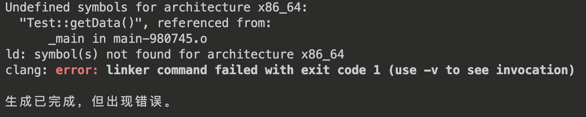

## 类成员的编译顺序

```cpp
class A
{
public:

    A() = default;
    void print(void)
    {
        std::cout << a << std::endl;
    }
private:
    int a;
};
```

为啥 a 的定义在 print 后面，print 还可以使用 a 呢？

编译器分两步处理类：

* 首先，编译成员的声明
* 然后，才轮到成员函数体

于是，成员函数体可以随意使用类的其他成员而无需在意他们的出现次序

再来看一个例子：

```cpp
using Money = double;
std::string val = "114514";
class A
{
public:
    Money balance(void)
    {
        return val;
    }
private:
    Money val = 114.514;
};
```

在这个例子中，编译时，**先编译成员的声明**，在 A 类的作用域中，没有找到 Money 的定义，因此，在外层寻找，为 double，因此，A::val 的类型为 double，A::balance 返回值类型为 double，返回对象是 A::val，而不是外层的 string 对象

## 分割线

1. 如果某个函数在概念上是属于类的（也就是类接口的组成部分），但并没有定义在类中，那么，它的声明应该与 *类的声明* 在同一个头文件里，这样，用户在使用接口的任何部分时，就只需要引入一个头文件

2. 一般来说，执行输出的函数应尽可能 **减少** 对格式的控制，这样可以确保由用户来决定是否换行

3. 如果一个成员函数的定义在**类的外部**，那么它 **默认** 不是 内联(inline) 的，可以通过在定义处显式指定为内联函数；如果一个成员函数定义在类的内部，那么它是自动内联的（当然，编译器也可以忽略内联请求）

    例如：
    ```cpp
    struct People
    {
        int startMM;
        int startDD;
        int endMM;
        int endDD;
        People() // inline
            :startMM(0), startDD(0), endMM(0), endDD(0) {}
        People(const std::string &startTime, const std::string &endTime); // 非 inline
        bool judge(int mm, int dd);
    };
    inline bool People::judge(int mm, int dd) // inline
    {
        // ...
    }
    ```
    
    最好只在类外部定义的地方将函数声明为内联的，更容易理解

4. 封装的优点
    1. 确保用户代码不会轻易破坏封装对象的状态
    2. 被封装的类的具体实现可以随时改变，而无需调整用户代码

5. 对于公共部分的代码使用私有功能的函数（Primer 248 页）

## 类的声明

我们可以先声明一个类，而不定义它：

```cpp
class A;
```

这种声明也被称为前向声明。在 **前向声明到类定义之前**，该类是一个 **不完全类型**，也就是说，此时我们已知该类是一个类类型，但不知道它有哪些数据成员

因此，不完全类型只能在 **非常有限** 的场景使用：

* 定义该类的指针或引用
* **声明** （注意，不是定义）一个以 *不完全类型* 作为参数或返回值的函数

也就是说，我们不能：

* 创建一个不完全类型对象
* 访问不完全类型对象的成员

下面是一个不完全类型的例子：

```cpp
struct A;
// 在 A 类声明之后，定义之前，A 为一种不完整类型

void test0(void)
{
    A *a0; // 正确，可以定义一个指向不完整类型的指针或引用
    // A *a1 = new A; // 错误，编译器不知道不完整类型的大小，无法分配内存
}

void test1(A &a); // 正确，可以 声明 将 不完全类型 作为参数的函数

void test2(A &a)
{
    std::cout << a.data << std::endl; // 错误，A 类尚未定义，编译器不知道 A 有哪些成员
}

A test3(void); // 正确，可以 声明 将 不完全类型 作为返回值的函数

A test4(void)
{
    A a;
    return a; // 错误，不能定义一个将不完全类型作为返回值的函数
}

struct A
{
    int data = 0;
    A() = default;
};

// 此时，A 已经不是不完全类型
void test1(A &a)
{
    std::cout << a.data << std::endl; // 正确，A 类已经定义
}
```

## 分割线

1. 友元关系不具有传递性
   ```cpp
   struct B;
    class A
    {
        friend struct B;
        int data = 0;
    public:
        A() = default;
    };
    
    struct C;
    struct B
    {
        friend struct C;
        void modify(A &a)
        {
            a.data = 114;
        }   
    };
    
    struct C
    {
        void modify(A &a)
        {
            a.data = 514; // 错误，友元关系不具有传递性
        }
    };
   ```

2. 友元声明与作用域

    友元声明影响的仅仅是 **访问权限**，并非普通意义上的声明

    ```cpp
    class A
    {
        friend void print(A &a);
        int data = 0;
    
    public:
        void test(void)
        {
            print(*this); // 错误，print 尚未声明
        }
    
        void test1(void);
    
        void test2(void);
    };
    
    void A::test1(void)
    {
        print(*this); // 错误，print 尚未声明
    }
    
    void print(A &a)
    {
        std::cout << a.data << std::endl;
    }
    
    void A::test2(void)
    {
        print(*this); // 正确，print 已经被定义
    }
    ```

3. 名字查找与作用域

    ```cpp
    typedef string Type; 
    Type initVal();
    class Exercise
    {
    public:
        typedef double Type;
        /**
         * @param  double
         * @return double
         */
        Type setVal(Type);  
        /**
         * @return double
         */
        Type initVal(); 
    private:
        int val;
    };
    
    
    // parm：double
    // 返回值：std::string
    // 因为在这个作用域里，Type 是 std::string 类型
    Type Exercise::setVal(Type parm) // 错误，声明与定义不兼容
    {
        val = parm + initVal(); // 正确，可以将 double => int
        return val; // 错误，无法将 int 转换为 std::string
    }
    
    // 修改：
    Exercise::Type Exercise::setVal(Type parm)
    {
        val = parm + initVal();
        return val; // 正确，可以将 int 转换为 Exercise::Type(double)
    }
    ```

## 分割线

1. 养成使用构造函数初始值的习惯，可以避免想不到的编译错误，特别是类内含有 引用、const 成员
2. 考虑下面的类：  
    ```cpp
    struct A
    {
        int i;
        int j;
        A(int val)
            :j(val), i(j) {}
    };
    
    ```

    在初始化结束后，i 的值是多少？是 val 吗？

    构造函数初始值列表只说明用于初始化成员的值，**不限定初始化顺序**

    **成员的初始化顺序与他们在类中定义的顺序一致**

    因此，在 A::(int val) 中，先初始化 i，由于此时 j 尚未初始化，故初始化结束后，i 的值是未定义的

    如何避免？

    1. 最好令构造函数初始化顺序与成员定义的顺序一致
    <!-- 想想怎么修改 -->
    2. 如果可能，不要用一个成员去初始化另一个成员
    <!-- 想想怎么修改 -->


## 委托构造函数

在 C++11 中，扩展了构造函数初始值的功能，使得可以定义委托构造函数

和普通构造函数一样，包含初始化列表和函数体

在委托构造函数内，成员初始化列表只有一个入口，即 **被委托的构造函数**

举个例子：

```cpp
struct Sales_data
{
    Sales_data(const std::string &s, unsigned cnt, double price)
        :bookNo(s), units(cnt), revenue(cnt * price)
    {
        std::cout << "Sales_data(const std::string &s, unsigned cnt, double price)（被委托者） 的调用" << std::endl;
    }
    // 委托 Sales_data(const std::string &s, unsigned cnt, double price)
    Sales_data()
        :Sales_data("", 0, 0)
    {
        std::cout << "Sales_data()（委托者）的调用" << std::endl;
    }
    // 委托 Sales_data(const std::string &s, unsigned cnt, double price)
    Sales_data(const std::string &s)
        :Sales_data(s, 0, 0)
    {
        std::cout << "Sales_data(const std::string &s)（委托者）的调用" << std::endl;
    }
    // 委托 Sales_data()
    // 函数体执行顺序：
    // Sales_data(const std::string &s, unsigned cnt, double price)
    // Sales_data()
    // Sales_data(std::istream&)
    Sales_data(std::istream &is)
        :Sales_data()
    {
        is >> this->bookNo;
        std::cout << "Sales_data(std::istream &is)（委托者）的调用" << std::endl;
    }
    std::string bookNo;
    unsigned units;
    double revenue;
};

```

这里重点说一下 ```Sales_data::Sales_data(std::istream &is)```，它委托给了默认构造函数，而默认构造函数又委托了 ```Sales_data::Sales_data(const std::string &s, unsigned cnt, double price)``` 

### 委托构造函数的执行顺序

先执行 被委托函数 的函数体，再执行 委托函数 的函数体

对于上面的 Sales_data，编写如下测试函数：

```cpp
void test(void)
{
    Sales_data s0;
    std::cout << "-------------------------------------------------------" << std::endl;
    Sales_data s1("MAGA");
    std::cout << "-------------------------------------------------------" << std::endl;
    Sales_data s2("ShanDianWuLianBian", 10, 114.514);
    std::cout << "-------------------------------------------------------" << std::endl;
    Sales_data s3(std::cin);
}
```

**输出：**

```
Sales_data(const std::string &s, unsigned cnt, double price)（被委托者） 的调用
Sales_data()（委托者）的调用
-------------------------------------------------------
Sales_data(const std::string &s, unsigned cnt, double price)（被委托者） 的调用
Sales_data(const std::string &s)（委托者）的调用
-------------------------------------------------------
Sales_data(const std::string &s, unsigned cnt, double price)（被委托者） 的调用
-------------------------------------------------------
Sales_data(const std::string &s, unsigned cnt, double price)（被委托者） 的调用
Sales_data()（委托者）的调用
Sales_data(std::istream &is)（委托者）的调用
```

## 分割线

1. explicit 关键字只能出现在类内构造函数的 **声明** 处
2. explicit 构造函数只能用于直接初始化
    例如：
    ```cpp
    struct Sales_data
    {
        Sales_data(const std::string &s, unsigned cnt, double price)
            :bookNo(s), units(cnt), revenue(cnt * price) {}
        Sales_data()
            :Sales_data("", 0, 0) {}
        explicit Sales_data(const std::string &s)
            :Sales_data(s, 0, 0) {}
        std::string bookNo;
        unsigned units;
        double revenue;
    };
    
    Sales_data s0(std::string("nnn")); // 正确，直接初始化，没有隐式的类型转换
    Sales_data s = std::string("nnn"); // 错误，不能用于拷贝形式的初始化过程
    Sales_data s = static_cast<Sales_data>(std::string("nnn")); // 正确，显式的将 std::string 转换为 Sales_data
    ``` 

## 聚合类

当一个类满足：

* 所有成员都是 public 的
* 没有自定义任何构造函数
* 没有任何类内初始值
* 没有基类，没有虚函数

时，我们把它叫做 **聚合类**

可以看出，聚合类与 C 的结构体非常相似

可以用一个花括号来初始化一个聚合类对象：

```cpp
struct A
{
    int a;
    const char* s;
};

void test(void)
{
    A a0 = {666, "C++"};
    A a1 = {"C++", 666}; // 错误，初始化顺序与声明顺序不一致
    A a2 = {666}; // 正确，s 执行值初始化
    A a3 = {"C++"}; // 错误
    A a4 = {666, "C++", 2}; // 错误，初始值太多
}
```

此外，使用这种方式初始化聚合类对象时，会将花括号内的元素 **拷贝** 到聚合类对象中，因此，要求聚合类对象的成员具有合适的拷贝构造函数：

```cpp
class Test
{
    int val;
    int* ptr;
public:
    Test()
        :val(0), ptr(nullptr) {}
    Test(int val)
        :val(val), ptr(nullptr) {}
    Test(int val, int* ptr)
        :val(val), ptr(ptr) {}
    explicit Test(const Test &t)
    {
        std::cout << "拷贝构造函数" << std::endl;
        val = t.val;
        if(ptr)
            delete ptr;
        if(t.ptr)
            ptr = new int(*t.ptr);
    }
};

struct A
{
    int a;
    Test t;
};

void test(void)
{
    Test t;
    A a = {1, t}; // 错误，t 的拷贝构造函数是显式的，需要直接初始化
    A a1 = {1, Test(t)}; // 正确，显式调用 Test 的拷贝构造函数
    A a2;
    a2.a = 1;
    a2.t = t; // 调用 operator=
}

```

## 字面值常量类

数据成员都是 **字面值类型** 的 **聚合类** 是字面值常量类

此外，如果一个类不是聚合类，但它符合：

* 数据成员都是字面值类型
* 类内 **至少** 有一个 **constexpr 构造函数**
* 如果某个成员具有类内初始值，则该初始值必须是常量表达式；或者，该成员使用自己的 constexpr 构造函数
* 析构函数必须使用 **默认定义**

### constexpr 构造函数

虽然构造函数不能是 const 的，但是字面值常量类的构造函数可以是 constexpr 的，一个字面值常量类 **至少应该有一个** constexpr 构造函数

constexpr 构造函数的形式：

* 声明为 =default 的
* 声明为 =delete 的
* 由于构造函数不能有返回值，constexpr 函数不能有除了返回语句以外的任何语句，因此，constexpr 构造函数的函数体一般是**空**的

此外，constexpr 构造函数**应该初始化所有数据成员**

例子：

```cpp
class Debug
{
    bool hardware;
    bool IO;
    bool other;

public:
    // 含有默认参数
    constexpr Debug(bool state = true)
        :hardware(state), IO(state), other(state) {}
    constexpr Debug(bool hardware, bool IO, bool other)
        :hardware(hardware), IO(IO), other(other) {}

    // 不应该定义成 constexpr 的
    // 因为含有除了返回值以外的语句
    void setHardware(bool state)
    {
        hardware = state;
    }

    void setIO(bool state)
    {
        IO = state;
    }

    void setOther(bool state)
    {
        other = state;
    }

};
```

## 类的静态成员

1. 必须在 **类外** 定义和初始化每一个静态数据成员
1. 在类的外部定义静态成员函数时，**不能重复** static 关键字
2. 要想确保静态成员只定义一次，最好的办法是：**把静态数据成员的定义与其它非内联函数的定义放同一个文件中**
3. 通常情况，**静态成员不该在类内初始化**，但是，可以为静态成员提供 **const** 并且是 **整数类型** 的类内初始值，并且，该 **静态成员必须是字面值常量类型的 constexpr 的：**
    ```cpp
    int i = 2;

    class Example
    {
        static double rate = 0.1; // 错误，静态成员 rate 不是常量
        static constexpr std::string name = "NiuMa"; // 错误，提供的初始值不是整数类型
        static const double price = 114; // 错误，静态成员 price 不是 constexpr 的
        static const int cnt = i; // 错误，提供的初始值不是 const 的
        static constexpr double correct = 114.514; // 正确
    };
    ```
4. 即使一个常量静态数据成员在 类内 被初始化了，通常也应该在类外定义一下该成员：
    ```cpp
    struct A
    {
        static const int data = 2;
        static constexpr int len = 10;
    };
    
    const int A::data; // 定义，但不初始化，因为已经在类内初始化了
    constexpr int A::len;
    
    void test(void)
    {
        std::cout << A::data << std::endl;
        std::cout << A::len << std::endl;
    }
    ```
5. 静态数据成员可以是不完全类型
    ```cpp
    struct A;

    struct B
    {
        A a; // 错误，普通成员不能是不完全类型
        A *pa; // 正确，指针类型成员可以是不完全类型
        static A sa; // 正确，静态成员可以是不完全类型
    };
    
    struct A{};
    ```

6. 静态数据成员可以做函数的默认实参
    ```cpp
    struct A
    {
        int normalMember;
        static int staticMember;
    
        void func(int parm = normalMember); // 错误，普通成员不能做默认实参
    
        void func(int parm = staticMember); // 正确，静态成员可以做默认实参
    
    };
    ```
7. 常函数可以修改类的静态成员变量

## 内联函数或者 constexpr 函数应该定义在头文件中

对于某个给定的内联函数，它的多个定义应该保持一致，因此，内联函数或者 constexpr 函数通常应该定义在头文件中

此外，如果不定义在头文件中，可能出现意想不到的 **链接错误：**

```cpp
// test.h:
#pragma once

class Test
{
    static int data;

public:
    Test() = default;
    static int& getData(void);
    static void print(void);
    
};

// test.cpp:
#include <iostream>
#include "Test.h"

// 将 内联函数 定义在 cpp 文件中
inline int& Test::getData(void)
{
    return data;
}

void Test::print(void)
{
    std::cout << data << std::endl;
}

int Test::data = 1; // 初始化静态成员变量

// main.cpp
#include "Test.h"

int main(void)
{
    std::cout << Test::getData() << std::endl;
    Test::print();
}
```

上述代码一共在三个文件中编写，即 test.h, test.cpp, main.cpp 

在编译时，同时编译两个 cpp 文件，出现链接错误：



然而，我们只需要将上述代码的内联函数 ```inline int& Test::getData(void)``` 定义在 test.h 中，就不会发生链接错误