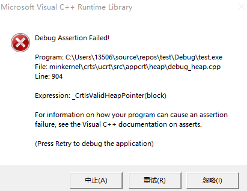

# 构造函数

## 一、定义

类通过它的若干个成员函数，来控制自己的对象的初始化过程，这种成员函数叫做构造函数

## 二、语法

<!-- ``` 类名(参数)  ``` -->
~~~C++
类名(参数)
{
    函数体
}
~~~

构造函数**没有返回值**，名称必须**与类名相同**。

## 三、分类

* 按参数分类：有参构造函数、无参构造函数
* 按类型分类：普通构造函数、拷贝构造函数

### 1. 无参构造函数

通常，我们把没有参数的构造函数称为默认构造函数

如果自己不实现构造函数，编译器会生成一个默认构造函数，且函数体为空

例如：
~~~C++
Test()
{
    std::cout << "Default constructor called" << std::endl;
} 
~~~

### 2. 有参构造函数

~~~C++
Test(int a)
{
    std::cout << "Parametric constructor called" << std::endl;
}
~~~

### 3. 拷贝构造函数

拷贝构造函数也是有参构造函数，且只有一个参数，参数类型是本类的**引用**。

由于我们在拷贝时，不希望修改被拷贝对象的值，因此，常在函数参数前加一个 const 防止修改被拷贝对象的值

此外，加了 const 后，就不能访问被拷贝对象的成员函数了（拷贝也没必要访问成员函数）


~~~C++
// 拷贝构造函数建议加一个const，因为我们不希望修改被拷贝对象的值
// 加了 const，被拷贝对象的成员函数不可访问
// 做拷贝，访问成员函数干嘛，拷贝成员属性即可
Test(const Test &t)
{
    val = t.val;
    std::cout << "Copy constructor called" << std::endl;
}
~~~

## 四、初始化列表

我们还可以像这样编写构造函数

~~~C++
class Test
{
    int val;
    int* ptr;
public:
    Test()
        :val(0), ptr(nullptr) {}
    Test(int val)
        :val(val), ptr(nullptr) {}
    Test(int val, int* ptr)
        :val(val), ptr(ptr) {}
};
~~~

这种编写构造函数的方式叫做**初始化列表**

## 五、构造函数的调用

一般来说，有三种方式：
* 括号法
* 显式调用
* 隐式调用

### 1. 括号法

~~~C++
// 1. 括号法

Test t0; // 默认构造函数
Test t1(0); // 有参构造函数
Test t2(t1); // 拷贝构造函数
~~~

**注意：** 在调用默认构造函数时，不要加括号，例如 ``` Test t0();  ``` 

编译器会**认为这是一个函数的声明**，**不会实例化对象**

### 2. 显式调用

~~~C++
// 2. 显式法

Test t3;
Test t4 = Test(0);
Test t5 = Test(t4);
~~~

右侧的 ```Test(0)```、```Test(t4)``` 相当于**匿名对象**，将匿名对象赋值给 ```t4```、 ```t5``` 

匿名对象如果不赋值给其他对象，会在实例化后立即被删除。

例如：

~~~C++
class Test
{
public:
    // 析构函数，销毁对象时自动调用
    ~Test()
    {
        std::cout << "Default destructor called." << std::endl;
    }
    Test(int a)
    {
        std::cout << "Parametric constructor called." << std::endl;
    }
};
int main(void)
{
    Test(0);
    std::cout << "Now executing the code of this line." << std::endl;
}
~~~

上述代码执行结果为：

~~~
Parametric constructor called
Default destructor called
Now executing the code of this line.
~~~

可以看出，在执行 ```std::cout << "Now executing the code of this line." << std::endl;``` 之前，匿名对象就已经被销毁了

**注意：** 实例化匿名对象时，不要使用拷贝构造函数。
例如：
~~~C++
Test t5 = Test(t4);
Test(t5); // 实例化匿名对象，调用拷贝构造函数
~~~
这样，编译器会认为你又在实例化 t5，重定义，编译失败

此外，匿名对象一般在**仿函数**中运用

### 3. 隐式调用

~~~C++
// 3. 隐式法

Test t6;
Test t7 = 0;
Test t8 = t7;
~~~

整体代码如下：
~~~C++
class Test
{
    int val;
public:
    // 析构函数，销毁对象时自动调用
    ~Test()
    {
        std::cout << "Default destructor called" << std::endl;
    }
    // 无参构造函数，即默认构造函数
    Test()
    {
        std::cout << "Default constructor called" << std::endl;
    } 
    Test(int a)
    {
        std::cout << "Parametric constructor called" << std::endl;
    }
    // 拷贝构造函数建议加一个const，因为我们不希望修改被拷贝对象的值
    // 加了 const，被拷贝对象的成员函数不可访问
    // 做拷贝，访问成员函数干嘛，拷贝成员属性即可
    Test(const Test &t)
    {
        val = t.val;
        std::cout << "Copy constructor called" << std::endl;
    }
};
int main(void)
{
    // 1. 括号法
    Test t0;
    Test t1(0);
    Test t2(t1);

    // 注意：在使用括号法，并想使用默认构造函数，不要加括号
    // 例如：
    // Test t0();
    // 编译器会认为这是一个函数的声明，不会实例化对象

    // 2. 显式法
    Test t3;
    Test t4 = Test(0);
    Test t5 = Test(t4);
    
    Test(0);  // 匿名对象，由于没有名称，在创建完以后会被立即释放

    // 注意：实例化匿名对象时，不要使用拷贝构造函数，这样，编译器会认为你又在实例化 t5，重定义，编译失败
    // Test(t5); 

    // 3. 隐式法
    Test t6;
    Test t7 = 0;
    Test t8 = t7;
}
~~~

选择哪种调用方式，取决于自己的喜好，只要能正确的调用，都 ok

## 六、拷贝构造函数调用时机

在 C++ 中，一般有三种情况会调用拷贝构造函数

1. 使用一个**已经实例化的对象**来实例化一个对象
2. 值传递的方式给函数传值（也就是不带引用）
3. 函数中，以值方式返回局部对象

首先，我们给出 Test 类
~~~C++
class Test
{
public:
    int val;
    Test()
    {
        std::cout << "Default constructor called" << std::endl;
    } 
    // 拷贝构造函数
    Test(const Test &t)
    {
        val = t.val;
        std::cout << "Copy constructor called" << std::endl;
    }
};
~~~

### 1. 使用一个**已经实例化的对象**来实例化一个对象

例如

~~~C++
Test t0;
Test t1 = t0;
~~~

执行结果为
~~~
Default constructor called
Copy constructor called
~~~

### 2. 值传递的方式给函数传值

例如：

~~~C++
void func(Test t0)
{
    std::cout << t0.val << std::endl;
}
int main(void)
{
    Test t0;
    t0.val = 0;
    func(t0);
}
~~~

执行结果为
~~~
Default constructor called
Copy constructor called
0
~~~


那如果将拷贝构造函数改为：

~~~C++
Test(const Test &t)
{
    val = t.val + 1;
    std::cout << "Copy constructor called" << std::endl;
}
~~~

则上面的代码的执行结果就为：

~~~
Default constructor called
Copy constructor called
1
~~~

从这里可以看出：由于拷贝构造函数的存在，**函数的形参的值等于函数调用时对应的实参**，这句话就**不一定正确**了。

最后需要**注意**的是：当采用引用的方式传递参数，就不会调用拷贝构造函数。因为引用传递相当于实参传递

### 3. 函数中，以值方式返回局部对象

例如：

~~~C++
Test func(void)
{
    Test t0;
    std::cout << (int*)&t0 << std::endl;
    return t0;
}
int main(void)
{
    Test t1 = func();
    std::cout << (int*)&t1 << std::endl;
}
~~~

为了更直观的看出拷贝函数的调用，我们可以将t0、t1的地址分别打印出来

在 MSVC 编译器的 **Debug模式**，执行结果如下

~~~
Default constructor called
000000F3A679FBB4
Copy constructor called
000000F3A679FCD4
~~~

可以看到，在 return t0 时，调用了拷贝构造函数。并且，t0、t1 的地址并不相同，这更加印证了：以值方式返回局部对象时，会调用拷贝构造函数。

值得注意的是，在 Release 模式下，编译器会对上述代码优化，直接将 t0 返回，不再执行拷贝操作。当然，这是与 C++ 标准相违背的，但效率更高。

## 七、构造函数调用规则

在 C++ 中，新建一个类，会自动创建三个成员函数

1. 默认构造函数（空实现）
2. 默认析构函数（空实现）
3. 默认拷贝构造函数（对成员属性进行**浅拷贝**）

构造函数调用规则如下：

1. 如果自己提供一个**有参构造函数**，那编译器就不再提供默认（无参）构造函数，但**仍会提供默认拷贝构造函数**
2. 如果自己提供一个**拷贝构造函数**，那编译器就不再提供默认（无参）构造函数

举个例子：

~~~C++
class Test
{
public:
    int val;
    Test(int val)
    :val(val){}
};
int main(void)
{
    // Test t0; // 错误，因为不再提供无参构造函数
    Test t0(0);
    Test t1 = t0;  // 正确，仍提供默认拷贝函数
}
~~~

如果只提供拷贝构造函数

~~~C++
class Test
{
public:
    int val;
    Test(const Test &t1)
    {
        val = t1.val;
    }
};
int main(void)
{
    // Test t0; // 错误，因为不再提供无参构造函数
}
~~~

## 八、深拷贝与浅拷贝

浅拷贝指的是值拷贝（地址相同），即简单的赋值操作；而深拷贝是重新在堆区开辟一块空间，存放被拷贝对象的值

编译器默认提供的拷贝构造函数是**浅拷贝**

如果类中含有在堆区开辟的元素，一般需要自己实现一个析构函数来控制元素的释放，此时**如果使用默认拷贝构造函数**，就很**危险**

举个例子：
~~~C++
class Test
{
public:
    int val;
    int* ptr;
    Test()
        :val(0), ptr(nullptr) {}
    Test(int val, int* ptr)
        :val(val), ptr(ptr) {}
    // 析构函数
    ~Test()
    {
        // ptr不为空，才删除
        if(ptr)
        {
            delete ptr;
            ptr = nullptr; // 防止野指针
        }
    }
};
void func(void)
{
    int* ptr = new int(0); // 在堆区申请内存
    Test t0(0, ptr); 
    Test t1 = t0; // 使用默认拷贝构造函数进行赋值操作
}
int main(void)
{
    func();
    return 0;
}
~~~

上述代码在执行过程中，会抛出异常



为什么呢？

来分析以下 func 执行的过程：

1. 实例化一个对象 t0
2. 调用默认拷贝构造函数进行赋值操作
3. func 结束，需要销毁局部变量t0、t1
4. 先销毁 t1，调用 t1 的析构函数，因为t1 的 ptr（与 t0 相同，假设地址为0x114514）不是空指针，所以 **delete t1 的 ptr**，并将 ptr 置空
5. 再销毁 t0，调用 t0 的析构函数，因为t0 的 ptr（地址与 t1 相同，为0x114514）不是空指针，所以**delete t0 的 ptr**。但是由于调用 t1 的析构函数时，**已经将 0x114514 所指向的空间释放了**，因此，这里再删除 t0 的 ptr（0x114514） 所指向的空间，构成**非法访问**，抛出异常

因此，**在类成员有在堆区的情况下，需要我们自己实现拷贝函数**。

~~~C++
class Test
{
public:
    int val;
    int* ptr;
    Test()
        :val(0), ptr(nullptr) {}
    Test(int val, int* ptr)
        :val(val), ptr(ptr) {}
    // 拷贝构造函数
    Test(const Test &t)
    {
        val = t.val;
        ptr = new int(*t.ptr); // 深拷贝：重新在堆区申请一块内存
    }
    // 析构函数
    ~Test()
    {
        // ptr不为空，才删除
        if(ptr)
        {
            delete ptr;
            ptr = nullptr; // 防止野指针
        }
    }
};
// ...... 与上面的func、main函数相同
~~~


