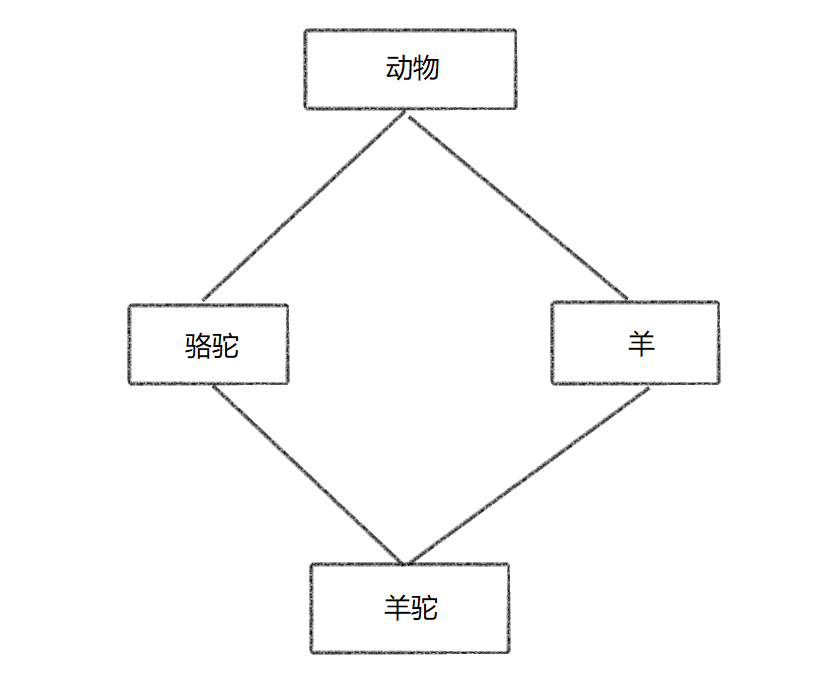

<!-- ~~~``` -->
# 继承

## 一、定义

>继承（英语：inheritance）是面向对象软件技术当中的一个概念。这种技术使得复用以前的代码非常容易，能够大大缩短开发周期，降低开发费用。

例如：定义一个汽车类，它包含了车的一些基本属性（如颜色、轮胎、排气量等）

然后，由汽车类，派生出小汽车类，它包含汽车类的所有成员属性，并且自己还有一些新的属性

此时，利用**继承**编写小汽车类，可以减少重复代码，提高代码的复用性

## 二、基本语法

```class 类名 : 继承方式 父类名```

## 三、继承方式

在 C++ 中，一共有三种继承方式：

* 公共继承
* 保护继承
* 私有继承

三种继承方式，使得子类继承下来的属性具有不同的访问权限，下面开始一一讲解

### 1. 公共继承（public）

首先给出父类 ```Dad```

~~~C++
// 父类
class Dad
{
public:
    int a;

protected:
    int b;

private:
    int c;
};
~~~

公共继承，在父类中，访问权限为 ```public```、```protected``` 的属性，继承到子类后，**访问权限不变**，但子类**无法访问**父类中访问权限为 ```private``` 的成员（注意：不是无法继承）

例如，给出 ```Son0``` 类

~~~C++
// 公共继承，不改变 Dad 属性的权限
// 但无法访问 Dad 的私有成员
class Son0 : public Dad
{
    void test(void)
    {   
        a = 10; // 仍为 public
        b = 10; // 仍为 protected
        // c = 10; // 无法访问 Dad 的私有成员
    }
};
~~~

再给出验证代码

~~~C++
// 验证公共继承
void test0(void)
{
    Son0 s0;
    s0.a = 0; // s0.a 在 Son0 中为公共成员属性
    // s0.b = 0; // s0.b 在 Son0 中为保护成员属性，类外不可访问
}
~~~

### 2. 保护继承（protected）

保护继承，在父类中，访问权限为 ```public```、```protected``` 的属性，继承到子类后，**访问权限均为protected**，子类也**无法访问**父类中访问权限为 ```private``` 的成员

例如，给出 ```Son1``` 类 

~~~C++
// 保护继承，继承后的属性均为 protected
// 也不能访问 Dad 的私有成员
class Son1 : protected Dad
{
public:
    void test(void)
    {
        a = 10; // 变为 protected
        b = 10; // 仍为 protected
        // c = 10; // 无法访问 Dad 的私有成员
    }
};
~~~

再给出验证代码

~~~C++
// 验证保护继承
void test1(void)
{
    Son1 s1;
    // s1.a = 10; // s1.a 在 Son1 中为保护成员属性，类外不可访问
    // s1.b = 10; // s1.b 在 Son1 中为保护成员属性，类外不可访问
}
~~~

### 3. 私有继承（private）

保护继承，在父类中，访问权限为 ```public```、```protected``` 的属性，继承到子类后，**访问权限均为private**，子类也**无法访问**父类中访问权限为 ```private``` 的成员

例如，给出 ```Son2``` 类 

~~~C++
// 私有继承，继承后的属性均为 private
// 也不能访问 Dad 的私有成员
class Son2 : private Dad
{
public:
    void test(void)
    {
        a = 10; // 变为 private
        b = 10; // 仍为 private
        // c = 10; // 无法访问 Dad 的私有成员
    }
};
~~~

再给出验证代码

~~~C++
void test2(void)
{
    Son2 s2;
    // s2.a = 10; // s1.a 在 Son2 中为私有成员属性，类外不可访问
    // s2.b = 10; // s1.b 在 Son2 中为私有成员属性，类外不可访问
}
//--------------------------------------------------------------
// 进一步验证了，私有继承，继承后的属性均为 private
// 即使是公共继承 Son2，也无法访问 Son2 的成员属性
// 因为 Son2 的成员属性均从 Dad 私有继承而来，权限均为私有
class SonOfSon2 : public Son2
{
public:
    void test(void)
    {
        // a = 10; // 无法访问 Son2 的私有成员
        // b = 10; // 无法访问 Son2 的私有成员
        // c = 10; // 无法访问 Dad 的私有成员
    }
};
~~~

### 三种继承方式总结

* 公有继承，继承的成员属性访问权限不变
* 保护继承，继承的成员属性访问权限均为 ```protected```
* 私有继承，继承的成员属性访问权限均为 ```private```

此外，三种继承方式**均不能访问**父类的私有成员，但这并**不代表没有继承父类中的私有成员**

~~~C++
// 虽然无法访问父类私有成员
// 但父类的私有成员也是被继承下来了的
// 只是编译器隐藏了，我们无法访问
void test2(void)
{
    // 输出结果为 12（三个整形数据）
    std::cout << "Sizeof Son0 = " << sizeof(Son0) << std::endl;
}
~~~
根据上面的代码，可以很直观的看到：Son0 继承了来自父类的所有成员

## 四、构造与析构顺序

在实例化一个子类时，是先调用父类的构造函数还是子类的构造函数呢？

在销毁一个子类时，是先调用父类的析构函数还是子类的析构函数呢？

直接上代码：

~~~C++
// 父类
class Dad
{
public:
    Dad()
    {
        std::cout << "Calling Dad's constructor function." << std::endl;
    }
    ~Dad()
    {
        std::cout << "Calling Dad's destructor function." << std::endl;
    }
};
// 子类
class Son0 : public Dad
{
public:
    Son0()
    {
        std::cout << "Calling Son0's constructor function." << std::endl;
    }
    ~Son0()
    {
        std::cout << "Calling Son0's destructor function." << std::endl;
    }
};
// 验证构造函数、析构函数的调用时机：
// 栈的 FILO 性质？
void test3(void)
{
    Son0 s0;
}
~~~

调用 test3 函数，输出结果为：
~~~
Calling Dad's constructor function.
Calling Son0's constructor function.
Calling Son0's destructor function.
Calling Dad's destructor function.
~~~

根据输出结果，可以发现：

* 实例化一个子类时，先调用父类的构造函数，再调用子类的构造函数（先有父亲再有儿子）
* 销毁一个子类时，先调用子类的析构函数，再调用父类的析构函数（白发人送黑发人）

## 五、继承中的同名成员处理

在继承中，难免会遇到子类与父类，存在成员属性名称相同的情况

### 同名非静态成员处理方式

先给出父类与子类

~~~C++
class Dad
{
public:
    Dad()
        :a(114514){}
    int a;
    void func(void)
    {
        std::cout << "Calling Dad's void func(void)." << std::endl;
    }
    void func(int a)
    {
        std::cout << "Calling Dad's void func(int a)." << std::endl;
    }
};

class Son : public Dad
{
public:
    Son()
        :a(2023){}
    int a;
    void func(void)
    {
        std::cout << "Calling Son's func(void)." << std::endl;
    }
};
~~~

然后，实例化一个 ```Son``` 类

~~~C++
Son s;
~~~

* 若访问 ```Son``` 中的同名成员，直接访问即可
    ~~~C++
    // 直接访问，访问的是子类中的 a
    std::cout << s.a << std::endl; 
    // 成员函数的调用也是一样的
    // 直接调用，调用的是子类中的 func
    s.func(); 
    ~~~
* 若访问 ```Dad``` 中的同名成员，需要**加上作用域**
    ~~~C++
    // 想要访问父类中的 a，需要加上作用域
    std::cout << s.Dad::a << std::endl;
    // s.func(100); // 直接调用，就算有父类同名函数参数与子类不同，编译器也不认
    // 还得加上作用域
    s.Dad::func();
    s.Dad::func(100);
    ~~~

**注意：** 就算有父类同名函数参数与子类不同，也就是发生了**重载**，**直接访问**并加上参数，仍然**无法调用父类的函数**

### 同名静态成员处理方式
    
对于静态成员，有两种方式访问

* 通过对象访问
* 通过类名访问

同样地，给出父类与子类

~~~C++
class Dad
{
public:
    static int b;
    static void static_func(void)
    {
        std::cout << "Calling Dad's static void static_func(void)." << std::endl;
    }
    static void static_func(int a)
    {
        std::cout << "Calling Dad's static void static_func(int a)." << std::endl;
    }
};

int Dad::b = 114514; // 静态变量初始化

class Son : public Dad
{
public:
    static int b;
    void func(void)
    {
        std::cout << "Calling Son's func(void)." << std::endl;
    }
    static void static_func(void)
    {
        std::cout << "Calling Son's static void static_func(void)." << std::endl;
    }
};

int Son::b = 2023;
~~~

与访问非静态同名成员一样，想要访问父类的同名成员，需加上作用域

#### 通过对象访问

~~~C++
// 通过对象访问
Son s;
// 直接访问，访问的是子类中的 b
std::cout << s.b << std::endl;
// 想要访问父类中的 b，需要加上作用域
std::cout << s.Dad::b << std::endl;
// 直接调用，调用的是子类中的 static_func
s.static_func();
// s.static_func(1); // 直接调用，就算有父类同名函数参数与子类不同，编译器也不认
// 想要调用父类中的 static_func，需要加上作用域
s.Dad::static_func();
s.Dad::static_func(1);
~~~

#### 通过类名访问

~~~C++
// 通过类名访问
// 直接访问，访问的是子类中的 b
std::cout << Son::b << std::endl;
// 想要访问父类中的 b，需要加上作用域
std::cout << Son::Dad::b << std::endl;
// 直接调用，调用的是子类中的 static_func
Son::static_func();
// 想要调用父类中的 static_func，需要加上作用域
Son::Dad::static_func();
Son::Dad::static_func(1);
~~~


## 六、多继承

一个子类可以同时有多个父类，子类继承多个父类的行为称为**多继承**

在实际开发中，通常**不建议使用多继承**，因为可能会产生同名现象，造成不必要的麻烦

### 语法

```class 子类名 : 继承方式 父类一, 继承方式 父类二 ... ```

### 实例

~~~C++
class Dad0
{
public:
    int a;
    Dad0()
        :a(0){}
};

class Dad1
{
public:
    int a;
    Dad1()
        :a(0){}
};

class Son : public Dad0, public Dad1
{
public:
    int c;
    int d;
    Son()
        :c(0), d(0){}
};

void test(void)
{
    Son s;
    // 当两个父类成员有重名现象，需加作用域区分
    // s.a = 11; // 报错：a 不明确
    s.Dad0::a = 11;
    s.Dad1::a = 4;
    s.c = 51;
    s.d = 4;
}
~~~

## 七、菱形继承

菱形继承是多继承的一种特殊情况

### 定义

> 两个子类继承同一个父类而又有子类同时继承这两个子类，这种继承方式形如菱形，因此叫做菱形继承



### 引入

观察上面的图片，可以发现：羊驼类发生了多继承


我们就以这四个类为例，讲讲菱形继承

~~~C++
class Animal
{
public:
    std::string color;
};
class Sheep : public Animal {};
class Camel : public Animal {};
class Alpaca : public Sheep, public Camel {};

void test(void)
{
    Alpaca alpaca;
    // alpaca.color = "white"; 报错：color 不明确
    alpaca.Sheep::color = "white"; // 合法
    alpaca.Camel::color = "brown"; // 也合法
}
~~~

在 test 函数中，实例化了一个羊驼。

然而，当我们想对羊驼的颜色进行赋值时，发现无法直接访问

为了访问到 color，需要加上作用域

但是，加上作用域，虽然可以正常访问，但是我们发现，alpaca 类中有两个 color，这是毫无意义的（一只羊驼怎么会同时有两种颜色捏）

为了减少资源浪费，同时让 color 有意义，我们需要用到 **虚继承**

### 虚继承的定义

>C++使用虚拟继承（Virtual Inheritance），使得派生类如果继承基类多次，但只有一份基类的拷贝在派生类对象中。

### 语法

```class 子类名 : virtual 继承方式 父类一, virtual 继承方式 父类二 ... ```

可以发现，与多继承语法唯一不同的就是：在继承方式前加上了 ```virtual``` 关键字

### 对引入的修改

利用虚继承，将引入部分的代码修改如下

~~~C++
class Animal
{
public:
    std::string color;
};
class Sheep : virtual public Animal {};
class Camel : virtual public Animal {};
class Alpaca : virtual public Sheep, public Camel {};

void test(void)
{
    Alpaca alpaca;
    alpaca.color = "white";
    // 当然，仍可以按以下两种方式进行赋值
    alpaca.Sheep::color = "white";
    alpaca.Camel::color = "white";
}
~~~

与不使用虚继承相比，使用虚继承后此时**只有一份** color 的拷贝在 alpaca 对象中，这样能够减少资源浪费，同时也让 color 有意义

## 八、总结

利用**继承**编写子类，可以减少重复代码，提高代码的复用性

继承的**三种方式**：

* 公有继承，继承的成员属性访问权限不变
* 保护继承，继承的成员属性访问权限均为 ```protected```
* 私有继承，继承的成员属性访问权限均为 ```private```

实例化子类与销毁子类，父类与子类的**构造函数、析构函数调用顺序**

* 实例化一个子类时，先调用父类的构造函数，再调用子类的构造函数（先有父亲再有儿子）
* 销毁一个子类时，先调用子类的析构函数，再调用父类的析构函数（白发人送黑发人）

当父类、子类存在**重名**成员时

* 访问子类同名成员，直接访问即可
* 访问父类同名成员，加上父类作用域

实际开发中，**不建议**使用**多继承**

利用**虚继承**，解决菱形继承带来的问题

最后，感谢你耐心看到这里，希望我的文章对你有所帮助