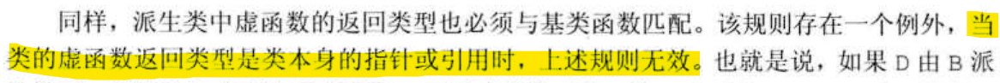

# 多态

## 一、基本概念

多态是 C++ 面向对象的三大特性之一（封装、继承、多态）

>多态按字面的意思就是多种形态。当类之间存在层次结构，并且类之间是通过**继承**关联时，就会用到多态。  
C++ 多态意味着调用成员函数时，会**根据调用函数的对象的类型**来**执行不同的函数**。

在 C++ 中，有两种类型的多态
* 静态多态：函数重载、运算符重载。
* 动态多态：由**派生类**和**虚函数**实现运行时多态

两种类型的区别

* 静态多态在**编译期**确定函数地址
* 动态多态在**运行阶段**确定函数地址

下面，结合实例加以解释

~~~C++
class Animal
{
public:
    void speak(void)
    {
        std::cout << "动物在说话" << std::endl;
    }
};

class XueBao : public Animal
{
public:
    void speak(void)
    {
        std::cout << "雪豹在说话" << std::endl;
    }
};

class DingZheng : public Animal
{
public:
    void speak(void)
    {
        std::cout << "丁真在说藏话" << std::endl;
    }
};

void letAnimalSpeak(Animal &animal)
{
    animal.speak();
}

void test(void)
{
    XueBao xueBao;
    letAnimalSpeak(xueBao);
    DingZheng dingZheng;
    letAnimalSpeak(dingZheng);
}

int main(void)
{
    test();
}
~~~

上述代码的执行结果为
~~~
动物在说话
动物在说话
~~~

很明显，执行结果与我们的预期并不相同，调用函数被编译器设置为父类中的 ```speak``` ，这就是**静态多态**，在编译期，函数地址就已经被确定

想要实现动态多态，只需要在父类的 ```speak``` 函数前加上 ```virtual``` 关键字即可

~~~C++
virtual void speak(void)
~~~

修改后的 ```speak``` 函数也叫做 **虚函数**

下面，我们重点讲解**动态多态**

## 二、动态多态的满足条件

一般来说，满足动态多态，需要两个条件：

* 有继承关系
* 子类**重写**父类的**虚函数**

>重写：与重载不同，重写需满足**返回值类型、函数名、形参列表**完全相同

注意，在动态多态中，存在一种特殊的重写：当待重写函数的返回值为**类本身的指针或引用**时，返回值类型**可以不同**

>  引用于 C++ primer 第五版 537页

## 三、动态多态的使用

想要使用动态多态，**必须使用父类指针或者父类的引用指向子类对象**

反映到上述的 speak 方法：

~~~C++
// 传引用或指针
void letAnimalSpeak(Animal &animal)
{
    animal.speak();
}
~~~

这里，传入的是父类的引用

如果不采用指针或引用的方式传递，那么会调用父类的 ```speak``` 函数

## 四、纯虚函数与抽象类

可以发现：在上述的 ```Animal``` 父类中，父类的 ```speak``` 虚函数的内部实现是完全没有意义的

事实上，在多态中，通常父类的虚函数的实现是毫无意义的，一般调用的都是子类重写的内容

因此，我们一般将父类的虚函数改写为**纯虚函数**

### 4.1 纯虚函数

#### 4.1.1 定义

被表明为不具体实现的虚拟成员函数称为纯虚函数

简单来说，就是告诉编译器，这里我不给出函数的具体实现，具体实现在子类中（有点类似函数声明）

#### 4.1.2 语法

```virtual 函数返回值类型 函数名(形参列表) = 0; ```


#### 4.1.3 适用情况

定义一个父类时，会遇到无法定义父类中虚函数的具体实现，其实现依赖于不同的子类。

### 4.2 抽象类

#### 4.2.1 定义

当一个类中**只要有一个纯虚函数**，这个类就成为了抽象类

#### 4.2.2 特点

* 无法实例化对象
* 子类**必须**重写父类的纯虚函数，否则，子类仍为抽象类

### 4.3 实例

下面以一个计算器类作为例子，介绍纯虚函数与抽象类的使用

~~~C++
#include<iostream>
// 实现两个数的运算

// 抽象类
class Calculator
{
protected:
    double num0;
    double num1;

public:
    // 纯虚函数
    // 只要有纯虚函数，就是抽象类
    // 抽象类无法实例化对象
    virtual double calculate(void) = 0; // 告知编译器，在父类中，我无法给出 calculate 的具体实现
};

class Add : public Calculator
{
public:
    Add(double num0, double num1)
    {
        this->num0 = num0;
        this->num1 = num1;
    }
    // 重写父类中的纯虚函数，否则子类仍然是抽象类
    double calculate(void)
    {
        return num0 + num1;
    }
};

// 多态的优点
// 1. 结构清晰
// 2. 可读性高
// 3. 扩展性强、易于维护（想要扩展父类的功能，只需要再编写一个子类，无需修改之前的代码）

// 扩展一个减法类

class Subtract : public Calculator
{
public:
    Subtract(double num0, double num1)
    {
        this->num0 = num0;
        this->num1 = num1;
    }
    double calculate(void)
    {
        return num0 - num1;
    }
};


// 传入父类的指针
void calculating(Calculator *cal)
{
    // 一个接口，有多种形态，可以实现多种功能
    std::cout << cal->calculate() << std::endl;
    delete cal;
    cal = nullptr;
}

int main(void)
{
    double num0, num1;
    char op;
    std::cin >> num0 >> op >> num1;
    switch (op)
    {
    case '+':
    {
        calculating(new Add(num0, num1));
        break;
    }
    case '-':
    {
        calculating(new Subtract(num0, num1));
        break;
    }
    default:
        std::cout << "Check Your Input!" << std::endl;
        break;
    }
}
~~~


与之前的动物类不同，在计算器类中，我们使用的是指针来传递对象

通过计算器类，可以发现多态的优点：

* 结构清晰
* 可读性强
* 扩展性高、易于维护（想要扩展父类的功能，只需要再编写一个子类，无需修改之前的代码）

因此，在实际开发中，如果发现满足多态的使用条件，应使用多态解决

## 五、虚析构与纯虚析构

在使用多态时，如果**父类不提供虚析构或纯虚析构函数**，那么**子类的析构函数就无法调用**，可能造成内存泄漏

因此，建议继承层次关系的**父类应该定义虚函数性质的析构函数**，即使这个析构函数不做任何的事情。

### 5.1 虚析构函数的语法

在父类的析构函数前加上 virtual 关键字，父类的析构函数就变为虚析构函数

~~~C++
virtual ~父类名称()
{
    具体实现
}
~~~

### 5.2 纯虚析构函数的语法

与纯虚函数类似

~~~C++
// 父类内
virtual ~父类名称() = 0;
------------------------
// 父类外
父类名称::~父类名称()
{
    具体实现
}
~~~

### 5.3 注意事项

无论是虚析构还是纯虚析构，都需要有**具体的函数实现**（就算是空实现）

### 5.4 测试代码

~~~C++
#include <iostream>
// 虚析构与纯虚析构
// 继承层次关系的父类应该定义虚函数性质的析构函数，即使这个析构函数不做任何的事情。
class Animal
{
public:
    Animal()
    {
        std::cout << "Calling Animal's constructor!" << std::endl;
    }
    // ~Animal()
    // {
    //     std::cout << "Calling Animal's destructor!" << std::endl;
    // }
    // 如果父类不提供虚析构函数或者纯虚析构函数
    // 就无法调用子类的虚构函数
    // 此时，若子类含有在堆区开辟的成员
    // 就会造成内存泄露

    // 虚析构函数
    virtual ~Animal()
    {
        std::cout << "Calling Animal's virtual destructor!" << std::endl;
    }

    // 纯虚析构函数
    // virtual ~Animal() = 0;

    virtual void speak(void) = 0;
};

// 类外给出具体实现（可以是空实现）
// Animal::~Animal()
// {
//     std::cout << "Calling Animal's virtual destructor!" << std::endl;
// }

// 子类含有在堆区开辟的成员
class Cat : public Animal
{
    std::string *name;

public:
    Cat(std::string name)
    {
        std::cout << "Calling Cat's constructor!" << std::endl;
        this->name = new std::string(name);
    }
    ~Cat()
    {
        std::cout << "Calling Cat's destructor!" << std::endl;
        delete name;
        name = nullptr;
    }
    void speak(void)
    {
        std::cout << *name << " cat is talking right now!" << std::endl;
    }
};

void test(void)
{
    Animal *animal = new Cat("Tom");
    animal->speak();
    delete animal;
    animal = nullptr;
}

int main(void)
{
    test();
    // 父类不提供虚析构函数的输出：
    // Calling Animal's constructor!
    // Calling Cat's constructor!
    // Tom cat is talking right now!
    // Calling Animal's destructor!
    // 可以发现：没有调用 Cat 的析构函数
}
~~~

## 六、总结

多态作为 C++ 面向对象的三大特性之一，应该提倡使用

一般有两种类型的多态，即静态多态与动态多态

* 静态多态在**编译期**确定函数地址
* 动态多态在**运行阶段**确定函数地址

想要使用动态多态，**必须使用父类指针或者父类的引用指向子类对象**

一般父类的虚函数内部没有什么意义，可改写为**纯虚函数**，此时，该类就变为了**抽象类**

在使用多态时，如果**父类不提供虚析构或纯虚析构函数**，那么**子类的析构函数就无法调用**。因此，建议继承层次关系的**父类应该定义虚函数性质的析构函数**，即使这个析构函数不做任何的事情。