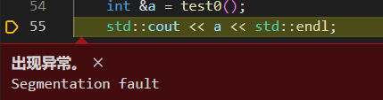
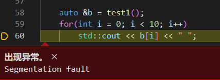
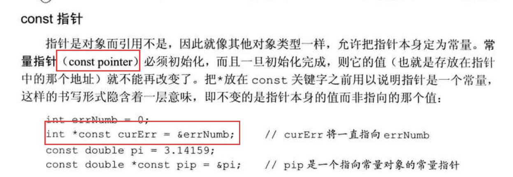

# 引用

## 一、基本语法

``` 数据类型 & 别名 = 要引用的变（常）量名 ```

## 二、注意事项

### 1. 引用必须初始化


例如，下面的代码

~~~C++
int &b;
~~~

这就是典型的没有初始化引用，应该这样写：

~~~C++
int a;
int &b = a;
~~~

### 2. 引用对象确定后，就不可改变

例如：

~~~C++
int a = 10;
int &b = a;
int c = 20;
b = c;
~~~

上述代码中，``` b = c ``` 这个操作并**没有改变 b 所引用的对象**，而是将 a 、b **赋值**为 20

## 三、引用做函数返回值

例如：

~~~C++
int& test(void)
{
    static int a = 10;
    return a;
}
int main(void)
{
    test() = 20;
    std::cout << test();
}
~~~

上述代码的输出结果为 ```20``` ，也就是说：**引用作为函数返回值时，函数调用可以作为左值**

注意到上面的 a 是**静态变量**，存放在全局区，也就是说，在 ```test``` 函数调用完后，**a 并不会被释放**

如果 a 是一个**局部变量**，存放在栈区，那将 a 作为返回值是很危险的，因为在 ```test``` 函数调用完后，**a 会被释放**。因此，**不要返回局部变量的引用**

当然，new 一个 a ，也就是存放在堆区，再将其返回，也是不可行的。

~~~C++
int& test0(void)
{
    int a = 10;
    return a;
}
int*& test1(void)
{
    int* a = new int[10];
    for (int i = 0; i < 10; i++) a[i] = i;
    return a;
}
int main(void)
{
    int &a = test0();
    std::cout << a << std::endl;
    std::cout << a << std::endl;

    int* &b = test1();
    for (int i = 0; i < 10; i++)
        std::cout << b[i] << " ";
    std::cout << std::endl;
    for (int i = 0; i < 10; i++)
        std::cout << b[i] << " ";
} 
~~~

可以看到，上述代码无法正常执行

  

## 四、引用的本质

引用实际上就是**常量指针（const pointer）**

根据C++ primer（第五版），给出常量指针（const pointer）的定义：



因此，结合常量指针的定义，我们就能想清楚
* 为什么引用必须初始化
* 为什么引用在确定对象后，就不能改变所引用的对象

### 为什么引用必须初始化

常量指针，本身就是一个常量，常量肯定是需要初始化的。而引用的底层实现又是常量指针，因此，引用也必须要初始化。

### 为什么引用在确定对象后，就不能改变所引用的对象

你想想，常量在初始化后，还能改变它的值吗？所以常量指针一旦初始化后，就不能改变它的值（也就是所指向的地址）。因此，引用在确定对象后，就不能改变其所引用的对象

~~~C++
int a = 10;
int* const b = &a; // 等价于 int& b = a; 编译器会将这句话转换为 int* const b = &a;
*b = 20; // 等价于 b = 20，编译器会帮我们解引用
int c = 30;
b = &c; // 错误，不允许改变所指对象，对应了引用不能改变其引用的对象
~~~

## 五、常量引用

在实际的项目开发中，有一些函数，它的使用者可能**不希望自己传进去的参数被改变**，而函数的编写者又**希望自己的函数在传参时不做额外的拷贝**；并且由于函数体可能很大，编写者**可能忘记了某个参数是不能改变的**，试图改变这个参数，这时，就可以用常量引用来解决上述问题。

例如：

~~~C++
void print(const std::vector<int> &nums)
{
    for(auto &num : nums)
    {
        std::cout << num << " ";
    }
    std::cout << std::endl;
}
~~~

如果该函数的编写者不小心的改变了 ```nums``` 中的一些值，就像这样

~~~C++
void print(const std::vector<int> &nums)
{
    ......
    nums[0] = 2;
    ......
}
~~~

此时，他就能看到如下报错信息：


这样，他就不会犯这种错误，同时又能高效的传参，也避免了错误的修改


